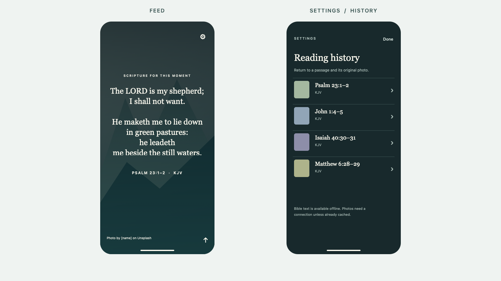

# Bible Scroll: product plan and UI reference

This image is an **illustrative design reference**. The shipped feed uses real Unsplash photos; the artwork in the image represents their placement and contrast treatment. The feed and Settings screens should remain visually close to these layouts.

## Product intent

Build a native iPhone app that feels like a short-form video feed, using still Unsplash photos with gentle Ken Burns motion and random passages from the King James Version. Each scene contains two or three consecutive verses from one chapter. The focus is quiet reading with very little visible chrome.

## Agreed interaction

1. The current photo fills the screen. Scripture sits above a dark contrast gradient in a centered serif typeface. Show the book, chapter, verse range, and `KJV` below it.
2. A short upward swipe slides the **entire scene** up and brings the next photo and passage from below. A downward swipe reverses the slide and restores an earlier scene. The photograph, scripture, reference, and credit move as one page.
3. If scripture exceeds its allotted area, an upward drag scrolls that text first. Dragging past the bottom advances the page. A downward drag at the top returns to the previous page. This handoff must work on the photo area and the text area without accidental page changes.
4. Scrolling back always shows the same passage with the same photo URL. Scrolling forward through existing history replays those same scenes. A new pairing is generated only beyond the latest seen scene. A photo prepared in advance must not appear in history until viewed.
5. There is **no history button in the feed**. The only feed control is a subtle gear in the upper corner. Settings contains the full history list; selecting an item returns to its position in the feed.
6. Show a discreet photographer and Unsplash credit on every photo. The gear has a full-sized tap target even though the icon is small. Respect Reduce Motion and support accessibility navigation.

## Visual system

- Full-bleed portrait photography, with a slow pan and scale change behind stationary scripture.
- Dark gradient or vignette over the photo, strong enough for white or warm ivory text to remain legible.
- Georgia-style serif passage text centered horizontally. Small tracked sans serif labels for the reference and secondary information.
- Reference immediately below the passage; photographer credit near the lower edge; no progress counter, reaction rail, or other social controls.
- Settings is a native dark sheet with an Unsplash Access Key field and a reverse-chronological history list with thumbnails and references.

## Content and persistence

- Bundle the complete 66-book KJV locally. `BibleScroll/Resources/kjv.txt` currently contains 31,102 verses imported from eBible's USFM source. The importer removes headings, footnotes, and Strong's metadata while preserving verse wording.
- Generate eligible passages from two or three consecutive verses in the same chapter, with a length range suited to the screen. Avoid recently shown references.
- A history entry stores a stable local ID, passage key, and photo URL. Its place in the array supplies ordering. Rebuild the verse text from the bundled KJV. Photo attribution metadata is stored separately by URL.
- Save the current history position across launches. Keep viewed history indefinitely unless a later product decision adds deletion or pruning.
- Request portrait nature photos from the Unsplash API with public `Client-ID` authentication. Store the Access Key in the iOS Keychain.
- Count API attempts in a rolling hour. After 40 requests, or when Unsplash reports ten or fewer calls left, reuse photos in the local pool and avoid immediate repeats. This budget is **per installation**; a public release sharing one key will need server-side coordination.
- Use returned Unsplash image URLs directly. Include links to the photographer and Unsplash with the required referral parameters.

## Code map

| Area | Files |
| --- | --- |
| Feed layout, slide transition, gesture routing | `BibleScroll/FeedView.swift`, `BibleScroll/PassageTextView.swift` |
| Ken Burns photo and contrast gradient | `BibleScroll/PhotoView.swift` |
| Ordered history, prefetch, 40-request budget | `BibleScroll/FeedStore.swift`, `BibleScroll/AppState.swift` |
| KJV indexing and passage selection | `BibleScroll/BibleLibrary.swift`, `BibleScroll/Resources/kjv.txt` |
| Unsplash request and attribution parsing | `BibleScroll/UnsplashClient.swift` |
| Settings and full history | `BibleScroll/SettingsView.swift` |
| Access Key storage | `BibleScroll/Keychain.swift` |
| Reproducible assets and data checks | `Scripts/`, `project.yml` |

## Current state and next checks

The app builds for iOS Simulator. The bundled KJV passes the repository's validation script: 66 books, 31,102 unique nonempty verses. The first-run screen and a scripture scene were visually inspected in an iPhone simulator. The whole-scene slide was added after that inspection and compiled, but **its motion and the long-text gesture handoff still need an on-device check**. An Xcode UI test was added for reverse navigation and Settings history; the local test runner stalled while finalizing its log, so that test has not produced a passing result. A real Unsplash request also needs an Access Key entered in Settings.

Before calling the interaction complete, verify these cases on an iPhone: short-text swipe up/down, long-text scrolling through its bottom and top, slide direction, replay after app restart, a working attribution link, the 40-request recycling behavior, and Reduce Motion. See the root `README.md` for build instructions.
